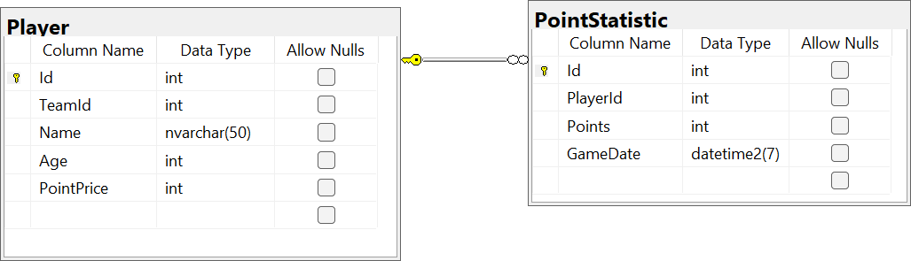
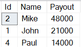
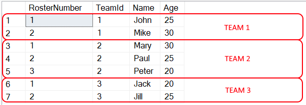

# Introduction
During a 60-minute session, you have to demonstrate your coding skills.
You'll get two tasks:
1. C# algorithmic task (~40 minutes).
2. SQL task (~20 minutes).

# Prerequisites
- An IDE of your choice (Visual Studio, Rider, Notepad++, etc).
- Access to an MS SQL (local or remote).
- MS SQL account that allows running DDL scripts (you will need to create two tables and seed some data).
- A git client of your choice; you'll have to get this repository to your computer.


# Task 1: Implement an algorithm in C#
You'll have to program a raffle game.

Game rules:
- a cashier has an unlimited number of tickets and when he sells a ticket, he records the name of the person who purchased the ticket; 
- when all the tickets are sold, a cashier counts the number of tickets each participant has and prepares a result report in the following format:
  - participant #1: 8 tickets
  - participant #2: 15 tickets
  - participant #3: 1 ticket
  - etc


Your endpoint should accept a cashier's report and select a winner.
The report is passed to your controller in a JSON format:
```json5
[
    {
        "id": {uniqueParticipantIdentifier},   	// an integer value
        "tickets": {numberOfTickets}		// an integer value
    },
    {
        "id": {uniqueParticipantIdentifier},
        "tickets": {numberOfTickets}
    },
	...
]
```

Your endpoint should return a response in the following format:

```json5
{
    "winnerId": {uniqueParticipantIdentifier}
}
```

Create an ASP.NET Core project with a Web API controller that can select a winner.

# Task 2: Write SQL queries
You're given a database with two tables.


_Player table:_
- Id: a unique identifier of a player.
- TeamId: specifies a player's team (a foreign key).
- Name: player's name.
- Age: player's age.
- PointPrice: an amount of money a player paid for each point they score.

_PointStatistic table:_
- Id: a unique identifier of an entry.
- PlayerId: specifies a player (a foreign key).
- Points: the number of points a player scored in a particular game.
- GameDate: a date when a game took place.

## Write the following queries:
1. Based on the statistics for the last 300 days, show IDs and names of the top 5 players who got the highest payouts.

   `Payout = PointPrice * Points`




2. Output team rosters. A roster is a list of all team players, numbered from 1 up to N. Number order should be defined in ascending order by the player's name.




3. Improve the previous query so it can define the sort order based on the value of @OrderBy local variable. This variable can have only 'Age' and 'Name' values.
